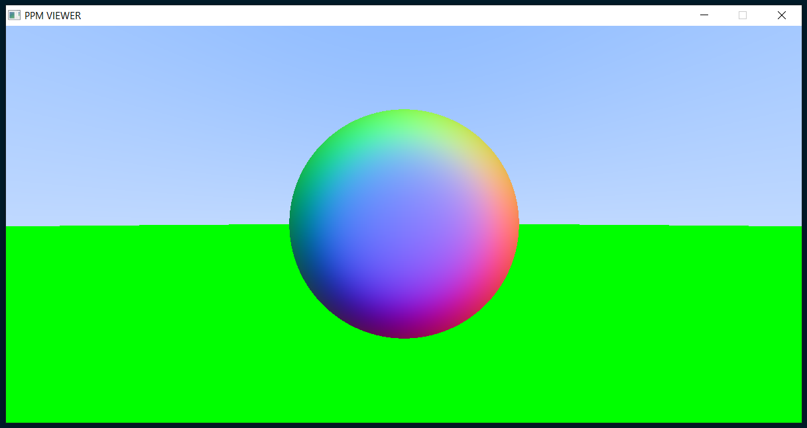

# PPM-VIEWER

A simple PPM viewer for Windows written in C++ using raylib.

### usage
1. Windows

        ./ppm.exe [ppm-file.ppm]

2. Linux (might need some changes to build.sh)

        ./ppm [ppm-file.ppm]

### building
1. Windows

        ./run.ps1

2. Linux (might need some changes to build.sh)

        chmod 700 build.sh
        ./build.sh

### example    
      ./ppm.exe image.ppm

